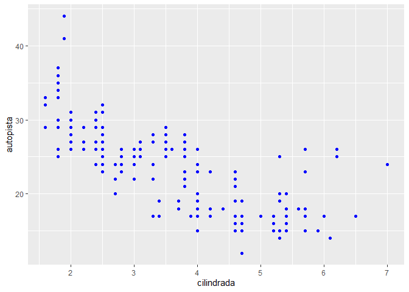
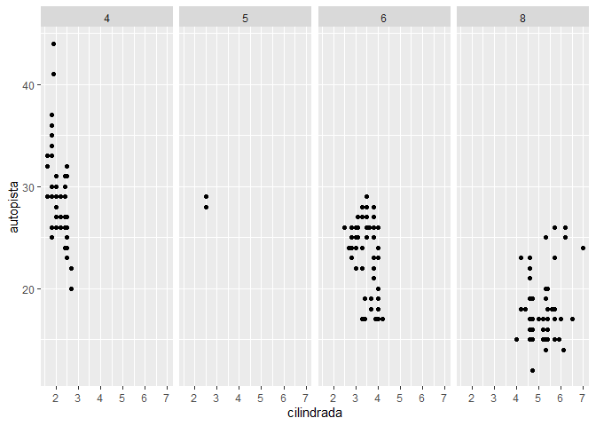
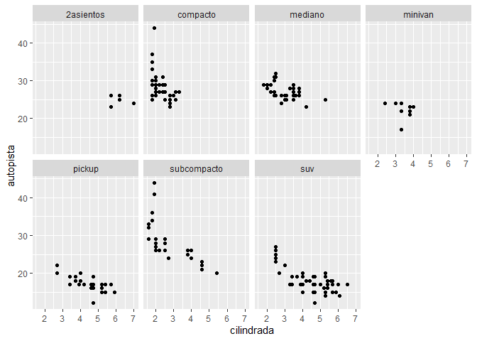
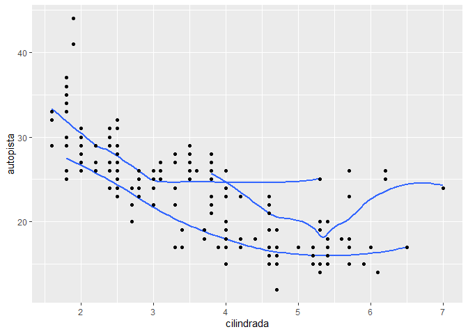
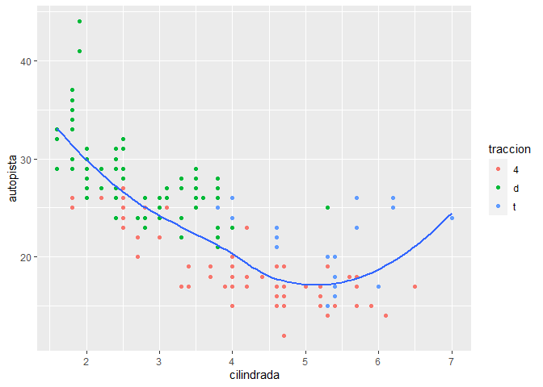

GGPLOT2
================
Dayeli Ruiz, Angely Rojas, Nolberto Comeca
27/1/2022

``` r
library(ggplot2)
library(tidyverse)
library(datos)
```

## PARTE 1: GGPLOT BASE

### Ejecuta *g**g**p**l**o**t*(*d**a**t**a*=*m**i**l**l**a**s*) . ¿Qué observas?

``` r
ggplot(data = millas)
```

<!-- -->

Nos muestra un gráfico “vacío”. Debido a que no se han dado las otras
dos capas mínimas: *a**e**s*() que es para mapear las variables y
*g**e**o**m*<sub>\*</sub>() para la representación gráfica necesaria.

### ¿Cuántas filas hay en millas? ¿Cuántas columnas?

Para saber cuantas filas hay

``` r
nrow(millas)
```

    ## [1] 234

Para saber cuantas columnas hay

``` r
ncol(millas)
```

    ## [1] 11

### ¿Qué describe la variable traccion? Lee la ayuda de ?millas para encontrar la respuesta.

``` r
unique(millas$traccion)
```

    ## [1] "d" "4" "t"

Esa una variable categórica que separa a los vehículos en tracción
delantera,trasera o de cuatro ruedas.

### Realiza un gráfico de dispersión de autopista versus cilindros.

``` r
ggplot(millas, aes(x = cilindros, y = autopista)) + geom_point()
```

<!-- -->

### ¿Qué sucede cuando haces un gráfico de dispersión (scatterplot) de clase versus traccion?¿Por qué no es útil este gráfico?

``` r
ggplot(millas, aes(x = clase, y = traccion)) +
  geom_point()
```

<!-- -->

El gráfico que nos da tiene escazos puntos. Debido a que las 2 variables
son categóricas y existe una cantidad limitada de combinaciones
posibles. Por lo que los gráficos de dispersión se deben usar con
variables continuas y valores unicos.

## PARTE 2: MAPEOS ESTETICOS

### ¿Qué no va bien en este código? ¿Por qué hay puntos que no son azules?

``` r
ggplot(data = millas) +
  geom_point(mapping = aes(x = cilindrada, y = autopista, color = "blue"))
```

<!-- -->

Como se puede ver, el color esta dentro de *a**e**s*(), por lo que se
toma como una variable,Para darle el color azul a los puntos debemos
cambiar el orden de los parámetros.Sacar el color de *a**e**s*

``` r
ggplot(data = millas) +
  geom_point(mapping = aes(x = cilindrada, y = autopista), color = "blue")
```

<!-- -->

### ¿Qué variables en millas son categóricas? ¿Qué variables son continuas? (Pista: escribe ?millas para leer la documentación de ayuda para este conjunto de datos). ¿Cómo puedes ver esta información cuando ejecutas millas?

-Variables categóricas: modelo, transmisión, tracción, combustible y
clase.

-Variables continuas: cilindrada, año, cilindros, ciudad, autopista.

### ¿Qué ocurre si asignas o mapeas la misma variable a múltiples estéticas?

``` r
ggplot(millas, aes(x = cilindrada, y = ciudad, colour = ciudad, size = ciudad)) +
  geom_point()
```

<!-- -->

Nos dará una información falsa y repetida

### ¿Qué hace la estética stroke? ¿Con qué formas trabaja? (Pista: consulta ?*g**e**o**m*<sub>*p*</sub>*o**i**n**t*)

``` r
ggplot(mtautos, aes(millas, peso)) +
  geom_point(shape = 21, colour = "red", fill = "green", size = 6, stroke = 4)
```

<!-- -->

Cambia el tamaño de bordes de las formas dadas

### ¿Qué ocurre si se asigna o mapea una estética a algo diferente del nombre de una variable,

como *a**e**s*(*c**o**l**o**r*=*c**i**l**i**n**d**r**a**d**a*\<5)?

``` r
ggplot(millas, aes(x = ciudad, y = cilindrada, colour = cilindrada < 5)) +
  geom_point()
```

<!-- -->

R evalua la variable de acuerdo a lo establecido, para aes(color =
cilindrada \< 5) nos dira si es FALSE o TRUE con un color
respectivamente

## PARTE 3: FACETAS

### ¿Qué ocurre si intentas separar en facetas una variable continua?

``` r
ggplot(millas, aes(x = cilindrada, y = autopista)) +
  geom_point() +
  facet_grid(. ~ ciudad)
```

<!-- -->

La variable continua se convierte en una variable categórica

### ¿Qué significan las celdas vacías que aparecen en el gráfico generado usando facet_grid(traccion \~ cilindros)?¿Cómo se relacionan con este gráfico?

``` r
ggplot(data = millas) +
  geom_point(mapping = aes(x = traccion, y = cilindros))
```

<!-- -->

Las celdas vacías son las combinaciones de traccion y cilindros sin
observaciones.

``` r
ggplot(data = millas) +
  geom_point(mapping = aes(x = autopista, y = ciudad)) +
  facet_grid(traccion ~ cilindros)
```

<!-- -->

Al relacionarla vemos que son las mismas ubicaciones del grafico de
dispersión de autopista y ciudad.

### ¿Qué grafica el siguiente código? ¿Qué hace?

``` r
ggplot(data = millas) +
  geom_point(mapping = aes(x = cilindrada, y = autopista)) +
  facet_grid(traccion ~ .)
```

<!-- -->

``` r
ggplot(data = millas) +
  geom_point(mapping = aes(x = cilindrada, y = autopista)) +
  facet_grid(. ~ cilindros)
```

<!-- -->

-El símbolo . en autopista \~ . divide por valores de autopista en el
eje y. -Y . \~ en cilindrada divide por los valores de cilindrada en el
eje x.

### Mira de nuevo el primer gráfico en facetas presentado en esta sección:

``` r
ggplot(data = millas) +
  geom_point(mapping = aes(x = cilindrada, y = autopista)) +
  facet_wrap(~ clase, nrow = 2)
```

<!-- -->

### ¿Cuáles son las ventajas de separar en facetas en lugar de aplicar una estética de color?

La ventaja de separar en facetas en lugar de aplicar color es que nos se
puede incluir distintas categorías.

### ¿Cuáles son las desventajas? ¿Cómo cambiaría este balance si tuvieras un conjunto de datos más grande?

La desventaja seria al momento de comparar valores entre categorías,
seria dificil debido a que las observaciones para cada categoría se
ubican en distintos gráficos.

### Lee ?facet_wrap. ¿Qué hace nrow? ¿Qué hace ncol? ¿Qué otras opciones controlan el diseño de los paneles individuales?

*n**r**o**w* y *n**c**o**l* determinan el número de filas y columnas
cuando generamos facetas

### ¿Por qué facet_grid() no tiene argumentos nrow y ncol?

*f**a**c**e**t*<sub>*g*</sub>*r**i**d* no necesita nrow ni ncol debido a
que el número de valores únicos en la función nos da el numero de filas
y columnas.

### Cuando usas facet_grid(), generalmente deberías poner la variable con un mayor número de niveles únicos en las columnas. ¿Por qué?

Por que nos daría más espacio

## PARTE 4: OBJETOS GEOMÉTRICOS

### ¿Qué geom usarías para generar un gráfico de líneas? ¿Y para un diagrama de caja? ¿Y para un histograma? ¿Y para un gráfico de área?

gráfico de líneas: geom_line() diagrama de caja: geom_boxplot()
histograma: geom_histogram() gráfico de área: geom_area()

### Ejecuta este código en tu mente y predice cómo se verá el output. Luego, ejecuta el código en R y verifica tus predicciones.

``` r
ggplot(data = millas, mapping = aes(x = cilindrada, y = autopista, color = traccion)) +
  geom_point() +
  geom_smooth(se = FALSE)
```

    ## `geom_smooth()` using method = 'loess' and formula 'y ~ x'

<!-- -->

Nos dara un diagrama de dispersión con cilindrada en el eje x, autopista
en el eje, ademas de los puntos de colores y de acuerdo a traccion, a la
vez habra una línea de tendencia, sin el error estándar, para cada grupo
de traccion.

### ¿Qué muestra show.legend = FALSE? ¿Qué pasa si lo quitas? ¿Por qué crees que lo utilizamos antes en el capítulo?

*s**h**o**w*.*l**e**g**e**n**d* = FALSE Nos va a ocultar la leyenda.

En el ejemplo anterior la leyenda no seria necesaria debido a que no
ayuda a evidenciar los datos.

### ¿Se verán distintos estos gráficos? ¿Por qué sí o por qué no?

``` r
ggplot(data = millas, mapping = aes(x = cilindrada, y = autopista)) +
  geom_point() +
  geom_smooth()
```

    ## `geom_smooth()` using method = 'loess' and formula 'y ~ x'

<!-- -->

``` r
ggplot() +
  geom_point(data = millas, mapping = aes(x = cilindrada, y = autopista)) +
  geom_smooth(data = millas, mapping = aes(x = cilindrada, y = autopista))
```

    ## `geom_smooth()` using method = 'loess' and formula 'y ~ x'

<!-- -->

Los gráficos se verán iguales debido a que los comandos
*g**e**o**m*<sub>*p*</sub>*o**i**n**t*() y
*g**e**o**m*<sub>*s*</sub>*m**o**o**t**h*() van a tomar las estéticas y
datos de ggplot().Y al volver a llamarlos estarían redundando.

### Recrea el código R necesario para generar los siguientes gráficos:

``` r
ggplot(data = millas, mapping = aes(x = cilindrada, y = autopista)) +
   geom_point() +
   geom_smooth(se = FALSE)
```

    ## `geom_smooth()` using method = 'loess' and formula 'y ~ x'

<!-- -->

``` r
ggplot(data = millas, mapping = aes(x = cilindrada, y = autopista)) +
   geom_smooth(aes(group = traccion), se = FALSE) +
   geom_point()
```

    ## `geom_smooth()` using method = 'loess' and formula 'y ~ x'

<!-- -->

``` r
ggplot(data = millas, mapping = aes(x = cilindrada, y = autopista, color = traccion)) +
   geom_point() +
   geom_smooth(se = FALSE)
```

    ## `geom_smooth()` using method = 'loess' and formula 'y ~ x'

<!-- -->

``` r
ggplot(data = millas, mapping = aes(x = cilindrada, y = autopista)) +
   geom_point(aes(color = traccion)) +
   geom_smooth(se = FALSE)
```

    ## `geom_smooth()` using method = 'loess' and formula 'y ~ x'

<!-- -->

``` r
ggplot(data = millas, mapping = aes(x = cilindrada, y = autopista)) +
   geom_point(aes(color = traccion)) +
   geom_smooth(aes(linetype = traccion), se = FALSE)
```

    ## `geom_smooth()` using method = 'loess' and formula 'y ~ x'

<!-- -->

``` r
ggplot(data = millas, mapping = aes(x = cilindrada, y = autopista)) +
   geom_point(size = 4, colour = "white") +
   geom_point(aes(colour = traccion))
```

<!-- -->

## PARTE 5: GRAFICOS ESTADISTICOS

### ¿Cuál es el geom predeterminado asociado con stat_summary()? ¿Cómo podrías reescribir el gráfico anterior para usar esa función geom en lugar de la función stat?

El geom predeterminado por defecto para stat_summary() es
geom_pointrange() Para recrear el anterior se debe especificar los
valores de fun.ymin, fun.ymax, y fun.y.

``` r
ggplot(data = diamantes) +
  geom_pointrange(
    mapping = aes(x = corte, y = profundidad),
    stat = "summary",
    fun.ymin = min,
    fun.ymax = max,
    fun.y = median
  )
```

    ## Warning: Ignoring unknown parameters: fun.ymin, fun.ymax, fun.y

    ## No summary function supplied, defaulting to `mean_se()`

<!-- -->

### ¿Qué variables calcula stat_smooth()? ¿Qué parámetros controlan su comportamiento?

Variables que usa:

-   y: valor predicho
-   ymin: menor valor del intervalo de confianza
-   ymax: mayor valor del intervalo de confianza
-   se: error estándar

Parámetros que controlan:

-   method: cuál método utilizar
-   formula: las fórmulas, al igual que method, determinan cómo se hará
    el cálculo del intervalo de confianza y los argumentos adicionales
    que se requieran.
-   na.rm: si acaso se eliminarán los casos perdidos

## PARTE 6: AJUSTE DE POSICIÓN

### ¿Cuál es el problema con este gráfico? ¿Cómo podrías mejorarlo?

``` r
ggplot(data = millas, mapping = aes(x = ciudad, y = autopista)) +
  geom_point()
```

<!-- -->

``` r
ggplot(data = millas, mapping = aes(x = ciudad, y = autopista)) +
  geom_point(position = "jitter")
```

<!-- -->

### ¿Qué parámetros de geom_jitter() controlan la cantidad de ruido?

``` r
ggplot(data = millas, mapping = aes(x = ciudad, y = autopista)) +
  geom_point(position = position_jitter())
```

<!-- -->

``` r
ggplot(data = millas, mapping = aes(x = ciudad, y = autopista)) +
  geom_jitter(width = 0)
```

<!-- -->

``` r
ggplot(data = millas, mapping = aes(x = ciudad, y = autopista)) +
  geom_jitter(width = 40)
```

<!-- -->

### Compara y contrasta geom_jitter() con geom_count()

``` r
ggplot(data = millas, mapping = aes(x = ciudad, y = autopista)) +
  geom_jitter()
```

<!-- -->

``` r
ggplot(data = millas, mapping = aes(x = ciudad, y = autopista)) +
  geom_count() 
```

<!-- -->

Cambia el tamaño de los puntos

``` r
ggplot(data = millas, mapping = aes(x = ciudad, y = autopista, color = clase)) +
  geom_jitter() 
```

<!-- -->

Se agrega color a los puntos

### ¿Cuál es el ajuste de posición predeterminado de geom_boxplot()? Crea una visualización del conjunto de datos de millas que lo demuestre.

``` r
ggplot(data = millas, aes(x = transmision, y = autopista, colour = clase)) +
  geom_boxplot()
```

<!-- -->

``` r
ggplot(data = millas, aes(x = transmision, y = autopista, colour = clase)) +
  geom_boxplot(position = "identity") 
```

<!-- -->

Superposición

## PARTE 7: SISTEMA DE COORDENADAS

``` r
ggplot(data = millas, mapping = aes(x = ciudad, y = autopista)) +
  geom_point() +
  geom_abline() +
  coord_fixed()
```

<!-- -->

### Convierte un gráfico de barras apiladas en un gráfico circular usando coord_polar().

``` r
ggplot(millas, aes(x = factor(1), fill = traccion)) +
  geom_bar()
```

<!-- -->

``` r
ggplot(millas, aes(x = factor(1), fill = traccion)) +
  geom_bar(width = 1) +
  coord_polar(theta = "y")
```

<!-- -->

### ¿Qué hace labs()? Lee la documentación.

``` r
ggplot(data = millas, mapping = aes(x = clase, y = autopista)) +
  geom_boxplot() +
  coord_flip() +
  labs(y = "Millas por Galón en Autopista",
       x = "Clase",
       title = "Millas por Galón en Autopista por Tipo de Vehículo",
       subtitle = "1999-2008",
       caption = "http...") 
```

<!-- -->

Agrega los títulos de los ejes, título del gráfico y la leyenda

### ¿Qué te dice la gráfica siguiente sobre la relación entre ciudad y autopista? ¿Por qué es coord_fixed() importante? ¿Qué hace geom_abline()?

``` r
ggplot(data = millas, mapping = aes(x = ciudad, y = autopista)) +
  geom_point() +
  geom_abline() +
  coord_fixed()
```

<!-- -->

La función coord_fixed() asegura que la línea que genera geom_abline()
tenga un ángulo de 45 grados. De este modo es más fácil comparar a
partir de los casos en que los rendimientos en autopista y ciudad son
iguales. Lo que podemos ver es que en todos los modelos el rendimiento
en autopista es superior al rendmiento en ciudad.
